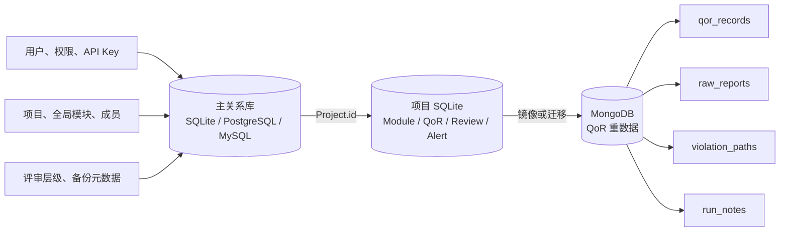
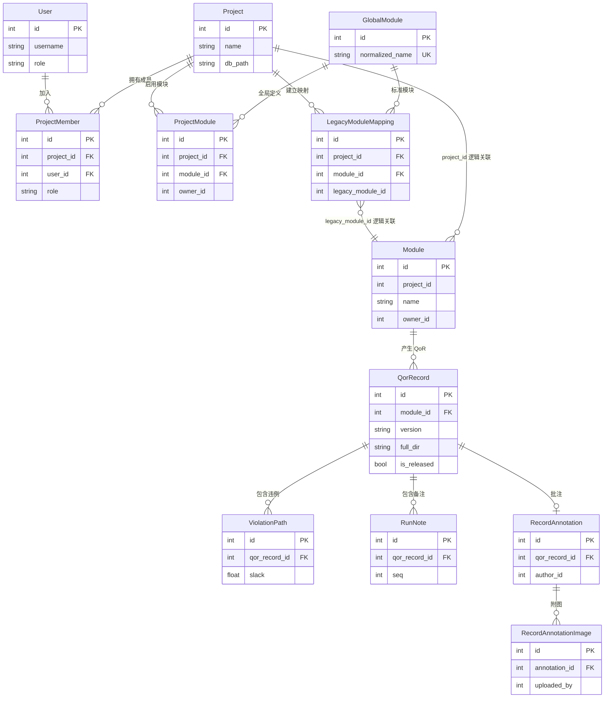
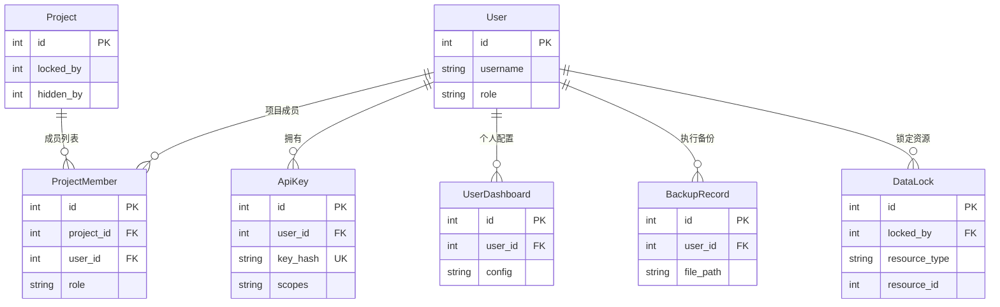
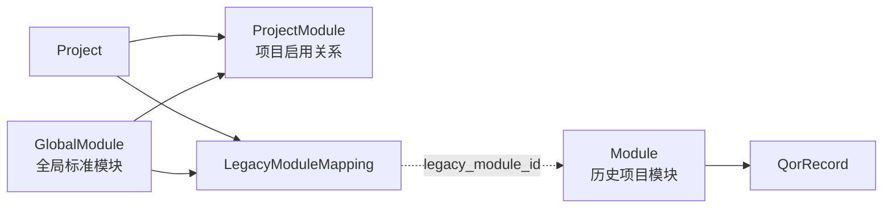
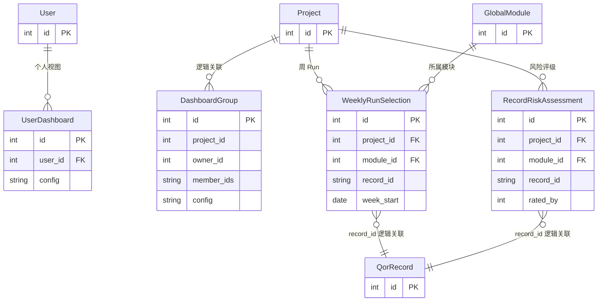
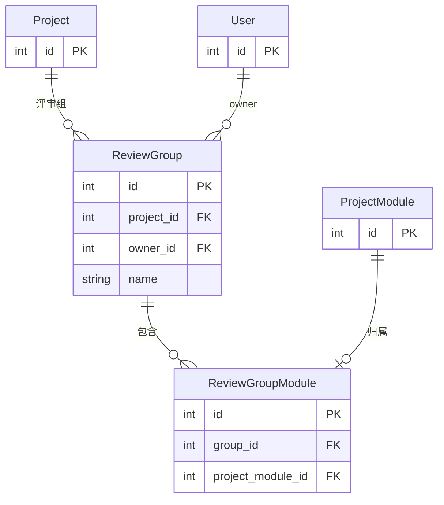
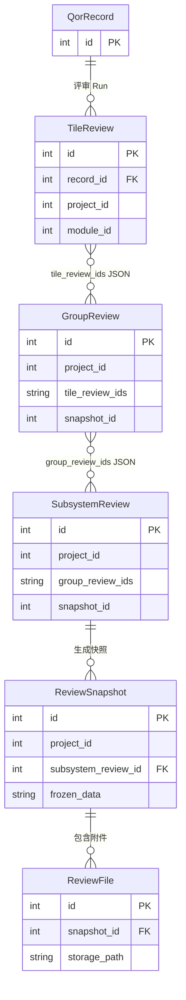
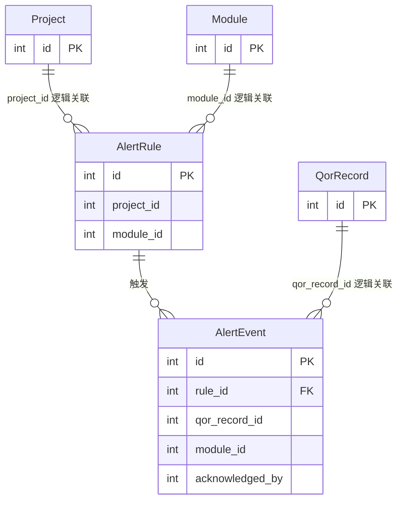
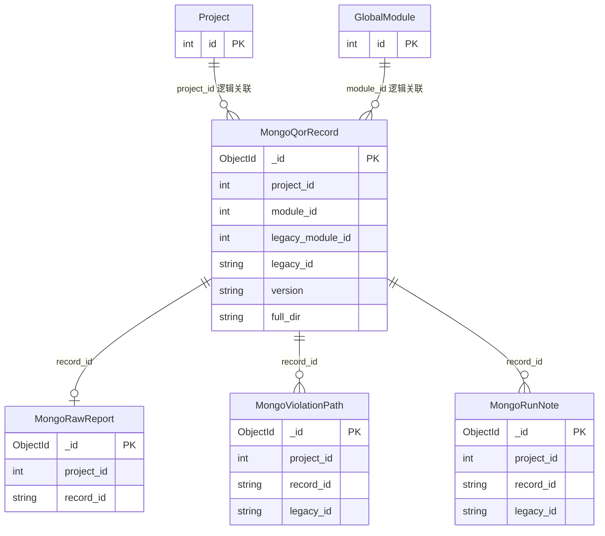

# QoR Recorder 数据库关系说明

本文帮助开发和运维人员理解 QoR Recorder 的数据存储边界、核心实体关系以及跨数据库逻辑关联。

> 本文以当前 `main` 分支为基准。当前代码支持主关系库、项目 SQLite 和可选 MongoDB。PostgreSQL + MongoDB 改造合并后，SQLite 将主要用于历史数据迁移和回滚兼容。

## 1. 存储架构



### 1.1 当前 `main` 分支

| 存储层 | 默认实现 | 主要数据 |
|---|---|---|
| 主库 `default` | SQLite，可配置 PostgreSQL/MySQL | 用户、项目、权限、全局模块、API Key、备份元数据 |
| 项目库 `project_<id>` | 每个项目一个 SQLite | Module、QorRecord、评审、告警、Dashboard 配置 |
| QoR 重数据层 | 可选 MongoDB | records、raw reports、violations、notes |

### 1.2 PostgreSQL + MongoDB 改造后的目标

| 存储层 | 主要数据 |
|---|---|
| PostgreSQL | 用户、项目、权限、模块关系、评审、配置 |
| MongoDB | QoR records、raw reports、violations、notes |
| 历史 SQLite | 仅用于迁移、审计和回滚兼容 |

## 2. 核心实体关系



核心数据链：

```text
Project
  └── Module
      └── QorRecord
          ├── ViolationPath
          ├── RunNote
          └── RecordAnnotation
              └── RecordAnnotationImage
```

## 3. 身份与权限关系



说明：

- `ProjectMember` 唯一标识一个用户在一个项目中的角色。
- `DataLock.resource_type + resource_id` 是多态逻辑关联，不是数据库真实外键。
- 项目库中的 `owner_id`、`created_by` 等字段通常只保存主库 `User.id`。

## 4. 模块双轨关系



| 实体 | 用途 |
|---|---|
| `GlobalModule` | 跨项目统一的模块定义 |
| `ProjectModule` | 表示某项目启用了哪个全局模块 |
| `Module` | 历史项目数据库中的模块 |
| `LegacyModuleMapping` | 连接全局模块和项目库 Module |

当前 `QorRecord.module_id` 仍以历史 `Module` 为 ORM 外键，因此查询跨项目数据时不能只使用裸 `Module.id`。

## 5. Dashboard 与风险数据



`WeeklyRunSelection.record_id` 和 `RecordRiskAssessment.record_id` 指向项目数据中的 QorRecord，但因为跨数据库，数据库层没有真实 FK。

## 6. 评审关系

### 6.1 主库评审层级



### 6.2 项目评审工作流



注意：

- `TileReview → GroupReview → SubsystemReview` 是三级评审流程。
- `tile_review_ids` 和 `group_review_ids` 是 JSON ID 数组，不是数据库 M2M 表。
- `GroupReview.group_name` 与主库 `ReviewGroup.name` 通过名称约定关联，没有真实 FK。
- `ReviewSnapshot` 是评审输入冻结数据，不要与运维回滚使用的 `DataSnapshot` 混淆。

## 7. 告警关系



只有 `AlertEvent.rule_id` 是真实 FK；记录、模块和用户字段由应用层维护。

## 8. MongoDB 文档关系



MongoDB 不支持这里描述的数据库 FK，所有关系都是应用层逻辑关联：

| Mongo 字段 | 指向 |
|---|---|
| `qor_records.project_id` | 关系库 `Project.id` |
| `qor_records.module_id` | 关系库 `GlobalModule.id` |
| `qor_records.legacy_module_id` | 历史项目库 `Module.id` |
| `qor_records.legacy_id` | 历史项目库 `QorRecord.id` |
| 子集合 `record_id` | Mongo `qor_records._id` 的字符串形式 |

主要索引：

- `qor_records`: `(project_id, module_id, version)`
- `qor_records`: `(project_id, recorded_at)`
- `qor_records`: `(project_id, full_dir)`
- `raw_reports`: 唯一 `(project_id, record_id)`
- `violation_paths`: `(project_id, record_id, slack)`
- `run_notes`: `(project_id, record_id, seq)`

## 9. 无真实 FK 的重要关系

以下关系由业务代码维护，数据库不会自动保证完整性：

| 来源 | 目标 | 关联字段 |
|---|---|---|
| 项目库 `Module` | 主库 `Project` | `project_id` |
| 项目库 owner/author 字段 | 主库 `User` | `owner_id`、`author_id` 等 |
| `LegacyModuleMapping` | 项目库 `Module` | `legacy_module_id` |
| `WeeklyRunSelection` | `QorRecord` | `record_id` |
| `RecordRiskAssessment` | `QorRecord` | `record_id` |
| `GroupReview` | `TileReview` | `tile_review_ids` JSON |
| `SubsystemReview` | `GroupReview` | `group_review_ids` JSON |
| `DataLock` | 任意业务实体 | `resource_type + resource_id` |
| Mongo QoR 文档 | 关系库实体 | `project_id/module_id/legacy_id` |

删除或迁移数据时，必须额外检查这些逻辑关联，不能只依赖数据库级联。

## 10. 从代码理解数据库

推荐阅读顺序：

1. `django_app/core/models.py`：模型和字段定义。
2. `django_app/core/db_routing.py`：模型被路由到哪个数据库。
3. `django_app/repositories.py`：MongoDB collection 和查询策略。
4. `django_app/services/qor_import.py`：上传数据如何生成关联记录。
5. `django_app/api_v2.py`：Dashboard 如何读取数据。
6. `django_app/core/management/commands/`：数据迁移和兼容处理。

一句话概括：

> Project 管理项目，GlobalModule 管理标准模块，Module 是历史项目模块，QorRecord 是核心 Run，ViolationPath、RunNote 和 RecordAnnotation 都依附于 QorRecord。
